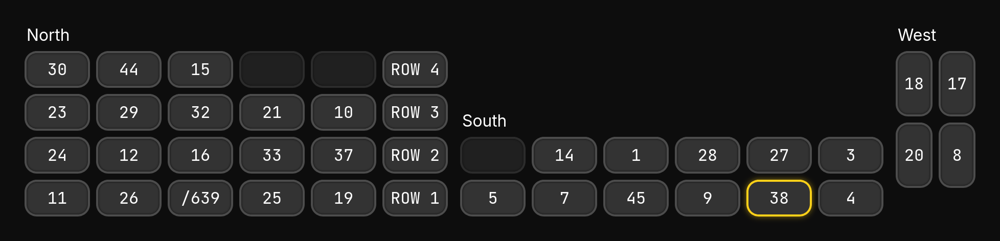

# Cronus
**Real-time tool to assist students in finding school buses during dismissal**

Cronus is a service designed to replace janky systems used by school districts to tell students where to find their bus during dismissal. 

The program is currently only in use by Lenape High School in Medford, NJ, and cannot be expanded to other schools just yet due to technical problems.

## Current Features
- Data collection from the following sources:
    - Google Sheets
- PWA Client
- Kiosk Display
- Live Preview

## Features in Development
- Multi-site support
- Notifications *of some kind*
- Routes display

---

Copyright © 2026 PegaSYS Technologies

This program is free software: you can redistribute it and/or modify
it under the terms of the GNU Affero General Public License as published
by the Free Software Foundation, either version 3 of the License, or
(at your option) any later version.

This program is distributed in the hope that it will be useful,
but WITHOUT ANY WARRANTY; without even the implied warranty of
MERCHANTABILITY or FITNESS FOR A PARTICULAR PURPOSE.  See the
GNU Affero General Public License for more details.

You should have received a copy of the GNU Affero General Public License
along with this program.  If not, see <https://www.gnu.org/licenses/>.
